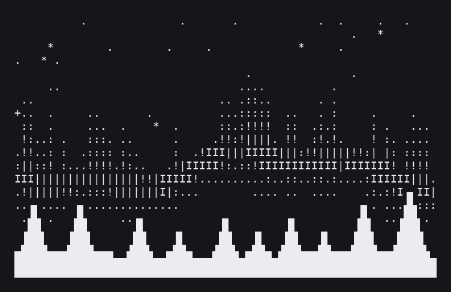
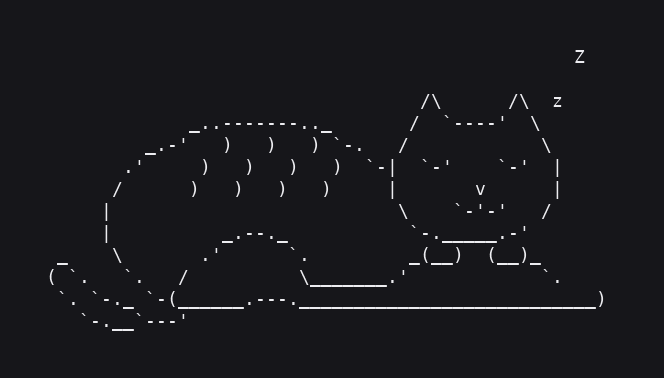

  

<h1 align="center">Autumn</h1>

  <em>Building quiet, private, well-made software — and writing about it along the way.</em>

  
  
  
  

## What I'm building

<table>
<tr>
<td width="50%" valign="top">

### 🌲 [Lattice](https://github.com/AutumnsGrove/Lattice)
The platform behind [Grove](https://grove.place): blogs, community, auth, storage, and theming for a quieter corner of the internet. A TypeScript monorepo on Cloudflare's edge.

</td>
<td width="50%" valign="top">

### ⭐ [Polaris](https://github.com/AutumnsGrove/Polaris)
A private, self-hosted AI assistant that searches the web through your own SearXNG instance. One Go binary, cited answers, no per-query cost.

</td>
</tr>
<tr>
<td width="50%" valign="top">

### 💬 [her-go](https://github.com/AutumnsGrove/her-go)
A privacy-first AI companion with multi-agent memory, mood tracking, and an evolving personality. Inspired by *Her*, built in Go.

</td>
<td width="50%" valign="top">

### 🎨 [Pixelsorting](https://github.com/AutumnsGrove/Pixelsorting)
A modern pixel-sorting app for making glitch art, with a clean web interface and a modular core.

</td>
</tr>
<tr>
<td colspan="2" valign="top">

### 🌿 [Ivy](https://github.com/AutumnsGrove/Ivy)
A self-hosted web mail client for one person. A single Go binary with an embedded SvelteKit frontend that mirrors your IMAP/SMTP mailbox into SQLite, then adds fast search, tags, rules, and careful LLM features on top. It never erases anything, treats email as hostile, and is built to run on a small board and be reached from your phone over Tailscale.

</td>
</tr>
</table>

**Also:** [Forage](https://domains.grove.place) (fast domain discovery) · [AmberSync](https://github.com/AutumnsGrove/AmberSync) (Obsidian-style sync on Cloudflare primitives) · [Mycelium](https://github.com/AutumnsGrove/Mycelium) (an MCP server for the Grove ecosystem) · [tavern](https://github.com/AutumnsGrove/tavern) (a D&D-flavored story engine in Telegram)

---

  

This repo also holds the source of my old personal site, kept as a small [museum](MUSEUM.md) for anyone who likes reading real code.
