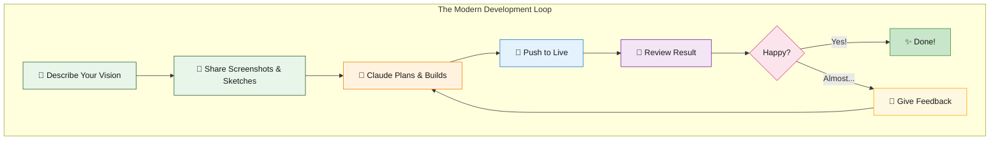

# Building with Claude Code - The Workflow

## How We Built the Gutter Feature

**Total Time:** ~1 hour
**Lines of Code Written by Human:** 0
**Screenshots Shared:** 4

### The Conversation Flow:

1. **"Add gutters to blog posts"** + rough sketch
2. Claude asks clarifying questions
3. Claude builds & pushes
4. **"Images too big, widen the gutter"** + screenshot
5. Claude adjusts & pushes
6. **"Items aren't anchored"** + screenshot
7. Claude fixes positioning & pushes
8. **"They're overlapping"** + screenshot
9. Claude adds collision detection & pushes
10. **"Add click to expand"**
11. Claude builds lightbox & pushes
12. ✅ **Done!**

---

*No framework docs. No Stack Overflow. No debugging config files.*
*Just describe what you want and watch it happen.*
