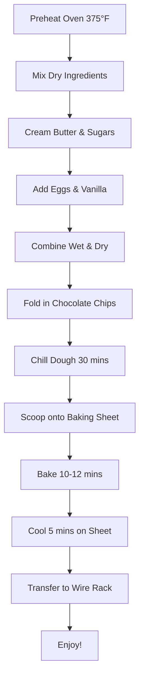

# Classic Chocolate Chip Cookies

The perfect chocolate chip cookie recipe that delivers soft, chewy centers with crispy edges and plenty of chocolate in every bite.

## Ingredients

- 2¼ cups all-purpose flour
- 1 tsp baking soda
- 1 tsp salt
- 1 cup butter, softened
- ¾ cup granulated sugar
- ¾ cup packed brown sugar
- 2 large eggs
- 2 tsp vanilla extract
- 2 cups chocolate chips

## Baking Workflow

## Instructions

1. **Preparation**: Preheat your oven to 375°F (190°C). Line baking sheets with parchment paper.

2. **Mix Dry Ingredients**: In a medium bowl, whisk together flour, baking soda, and salt. Set aside.

3. **Cream Butter and Sugars**: In a large bowl, beat softened butter with both sugars until light and fluffy (about 3-4 minutes).

4. **Add Wet Ingredients**: Beat in eggs one at a time, then stir in vanilla extract until well combined.

5. **Combine**: Gradually mix in the flour mixture until just incorporated. Don't overmix!

6. **Add Chocolate**: Fold in chocolate chips until evenly distributed throughout the dough.

7. **Chill**: Cover and refrigerate dough for at least 30 minutes (this prevents spreading and enhances flavor).

8. **Scoop**: Drop rounded tablespoons of dough onto prepared baking sheets, about 2 inches apart.

9. **Bake**: Bake for 10-12 minutes, or until edges are golden brown but centers still look slightly soft.

10. **Cool**: Let cookies cool on baking sheet for 5 minutes before transferring to a wire rack to cool completely.

## Tips for Perfect Cookies

- Use room temperature ingredients for better mixing
- Don't overmix once flour is added - this makes cookies tough
- Chill the dough for thicker, less spread cookies
- For extra chewy cookies, slightly underbake them
- Store in airtight container for up to 1 week
- Dough can be frozen for up to 3 months

## Variations

- Add 1 cup chopped nuts for extra texture
- Use dark chocolate chips for richer flavor
- Substitute ½ cup of chocolate chips with white chocolate chips
- Add sea salt on top before baking for sweet-salty contrast