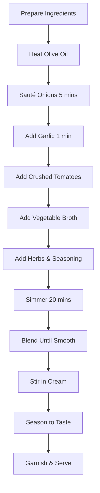

# Classic Tomato Soup

A comforting and hearty tomato soup that's perfect for a chilly day. This recipe creates a smooth, creamy soup with deep tomato flavor.

## Ingredients

- 2 cans (28 oz each) crushed tomatoes
- 1 large onion, diced
- 4 cloves garlic, minced
- 2 cups vegetable broth
- 1 cup heavy cream
- 3 tbsp olive oil
- 1 tsp dried basil
- 1 tsp dried oregano
- Salt and pepper to taste
- Fresh basil for garnish

## Cooking Workflow

## Instructions

1. **Prepare Ingredients**: Dice the onion, mince the garlic, and measure out all your ingredients.

2. **Sauté Aromatics**: Heat olive oil in a large pot over medium heat. Add the diced onion and cook for 5 minutes until translucent. Add minced garlic and cook for another minute until fragrant.

3. **Build the Soup Base**: Add crushed tomatoes, vegetable broth, dried basil, and oregano. Season with salt and pepper.

4. **Simmer**: Bring to a simmer, then reduce heat to low. Cover and let simmer for 20 minutes to allow flavors to meld.

5. **Blend**: Use an immersion blender to blend the soup until smooth and creamy. Alternatively, transfer in batches to a regular blender.

6. **Finish**: Stir in the heavy cream and heat through gently. Adjust seasoning if needed.

7. **Serve**: Ladle into bowls and garnish with fresh basil leaves. Serve with crusty bread for dipping.

## Tips

- For extra richness, use a combination of heavy cream and butter
- Add a pinch of sugar if tomatoes are too acidic
- This soup freezes well for up to 3 months
- For a lighter version, substitute milk for cream